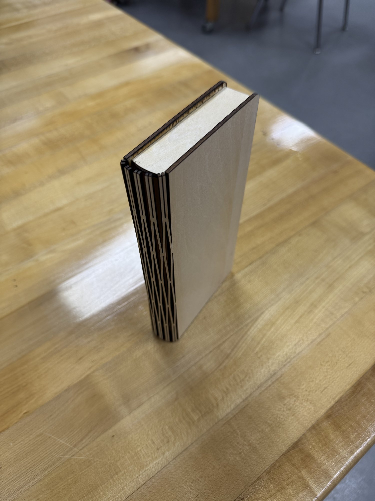
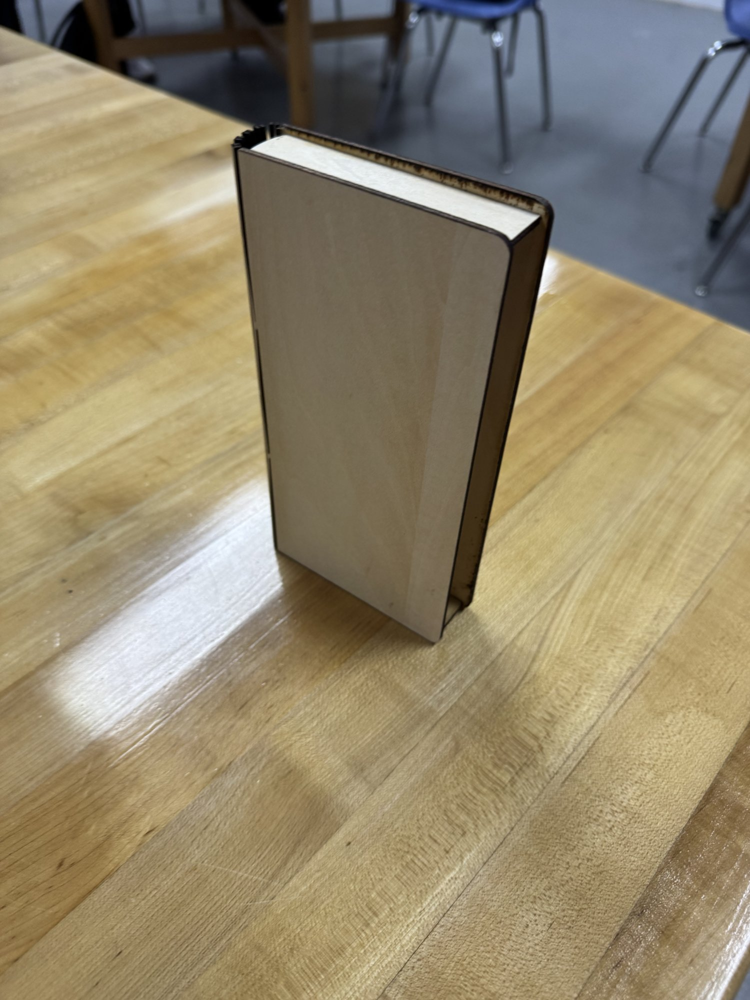

# Cover Prototype 1: Static Book Case

**Date:** 2026-09-25
**Status:** Prototype. Dimensions are accurate, no engraving or grooves yet.

## What it is
The first physical version of the redesigned cover. The cover is now a static case shaped like a hardcover book, and the folding chess board slides into it.

## What the photos show
- Laser cut plywood (light birch look, burnt dark edges from the laser)
- Flat front and back covers with rounded corners
- Curved spine made from a laser cut flexible pattern (living hinge), so flat wood bends round like a real book spine
- A light wood block sits between the covers at the top, where the pages would be on a real book

## Dimensions
TBD (being measured, will be added here)

## What's next
- Add the exact measurements
- Model the case in Fusion 360 from those numbers
- Design the engraving and grooves on the model before cutting the final version
- Size the folding board so it slides in with a small, even gap
