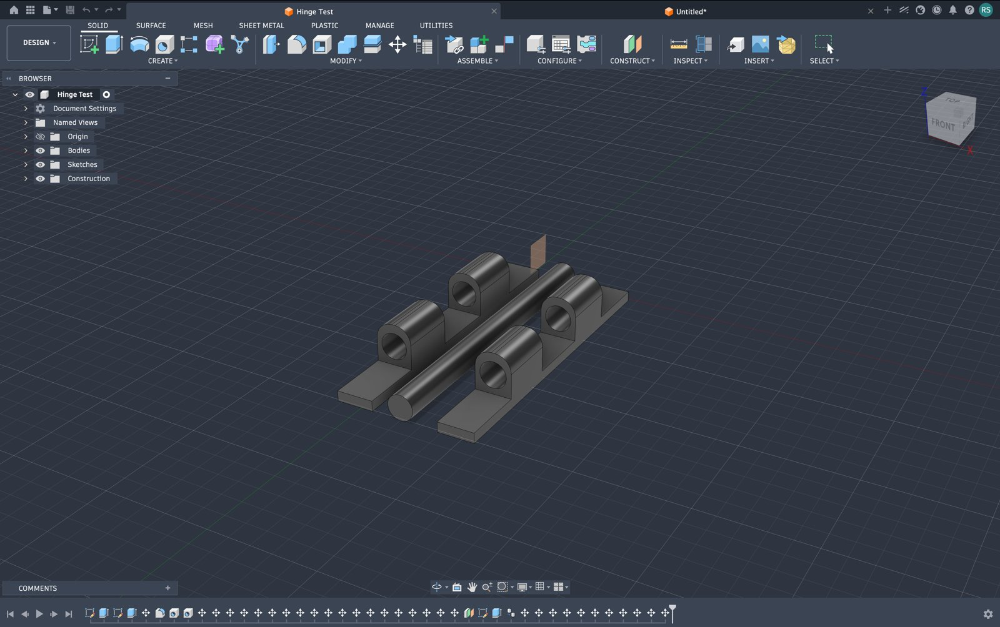

# Hinge Test 1: Print-in-Place Knuckle Hinge

**File:** `Hinge Test` (Fusion 360)
**Status:** Just a test, not the final hinge design.

## What it is
A print-in-place style hinge: two flat base plates, each with three interlocking cylindrical knuckles, alternating (plate A - plate B - plate A pattern), with a rod running through all the knuckles as the pivot axis. Built to test the knuckle/gap geometry before committing to a real hinge design for the book chess board.

## What happened
- Modeled the two halves as separate components with the knuckle geometry and rod.
- Set up a Revolute joint to test opening/closing motion.
- Ran into a Fusion 360 quirk: grounding does not carry over when a component is inserted into a new design, and dragging a component in the viewport moves the whole rigid occurrence rather than operating the internal joint. The fix is to drive the joint directly (browser tree → Joints folder → right-click the Revolute joint → Drive Joint) rather than dragging bodies.
- Didn't fully get the live joint simulation working end-to-end this round.

## Current plan
Move forward by manually measuring the physical clearances/gap needed (rather than relying on the Fusion joint simulation for now) and testing by eye/by hand once printed. Will revisit proper joint-driven simulation later if needed.

## Next steps
- Decide on knuckle gap tolerance (target 0.2 to 0.4 mm per side) and print a physical test piece.
- Check the print-in-place tolerance actually holds without fusing, and that it opens a full 180°.
