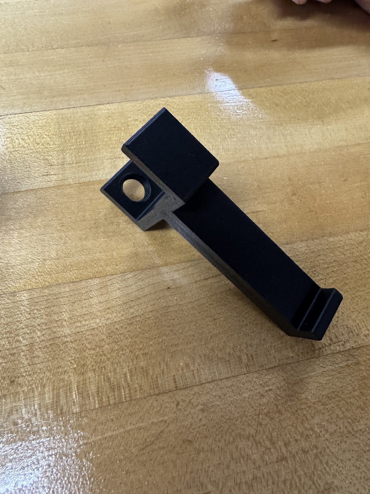
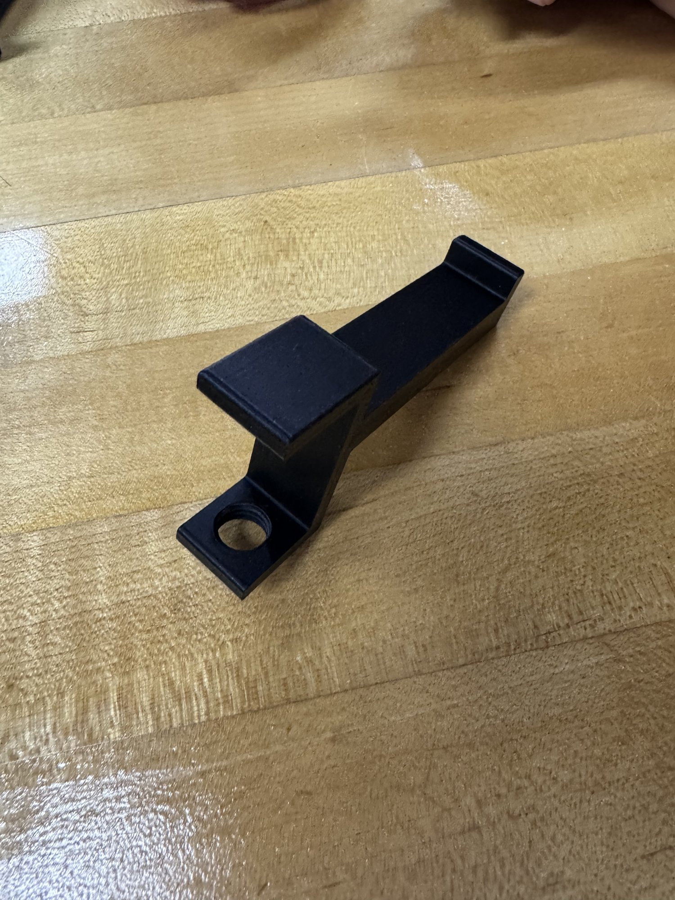

# Side Project: Trash Holder

**Date added:** 2026-09-25
**Status:** Printed

## What it is
A 3D printed trash holder bracket in black filament. Not part of the chess board project.

## What the photos show
- A long arm with a raised lip at the end
- A square flat pad on top near the base
- A mounting tab with a screw hole, so it can be screwed to a desk or wall

## Notes
TBD: how it mounts, what bag or bin it holds, and how well it works
