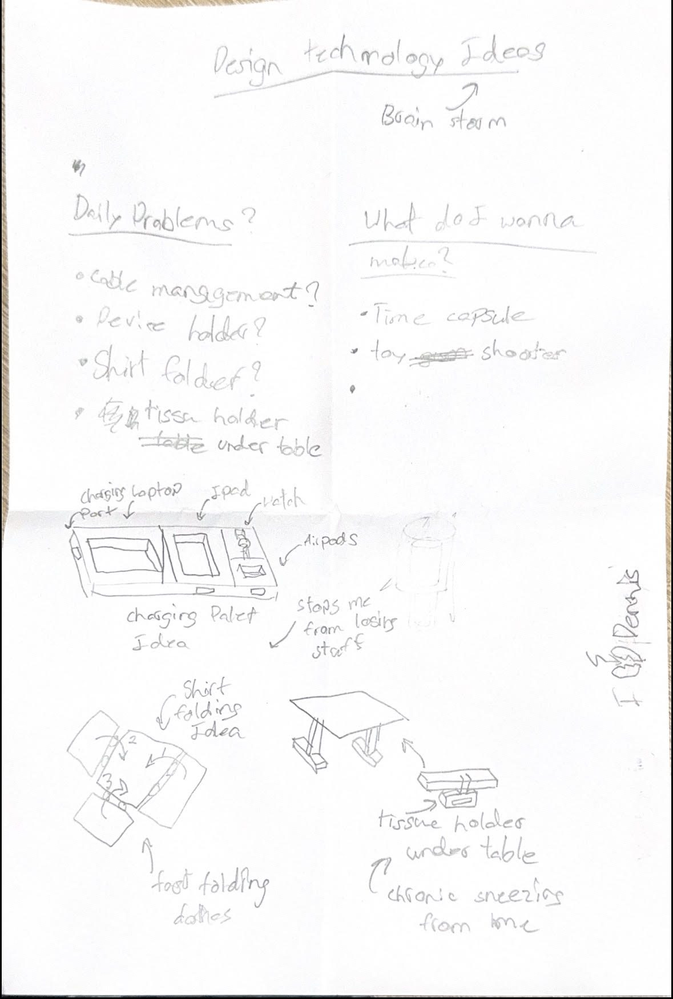

# Design Technology Ideas: Brainstorm

Transcribed from the handwritten brainstorm page above.

## Daily Problems?
- Cable management?
- Device holder?
- Shirt folder?
- Tissue holder under table (chronic sneezing from time, allergy trigger)

## What do I wanna make?
- Time capsule
- ~~Toy~~ Shooter
- (third bullet left blank)

## Sketch: Charging Pallet Idea
A charging dock/tray with labeled sections:
- Charging laptop port
- iPad slot
- Watch charging spot
- AirPods slot

Note: "Stops me from losing stuff"

## Sketch: Shirt Folding Idea
Numbered fold sequence (1 → 2 → 3) showing a fast shirt-folding method.
Note: "fast folding clothes"

## Sketch: Tissue Holder Under Table
(Later became a side project: `work/side-projects/trash-holder.md`)

A table with a tissue box/holder mounted underneath it.
Note: "chronic sneezing from tone" (likely "time", recurring allergy issue prompting this idea)

---
Signed: Dennis
