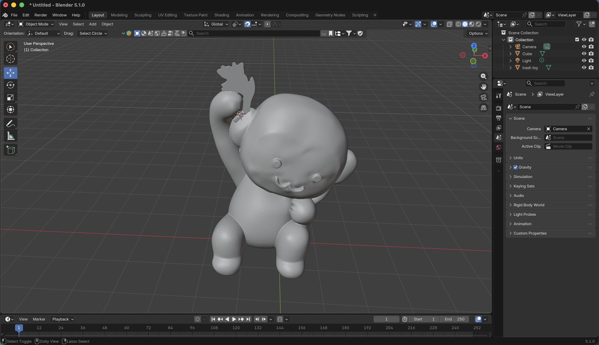
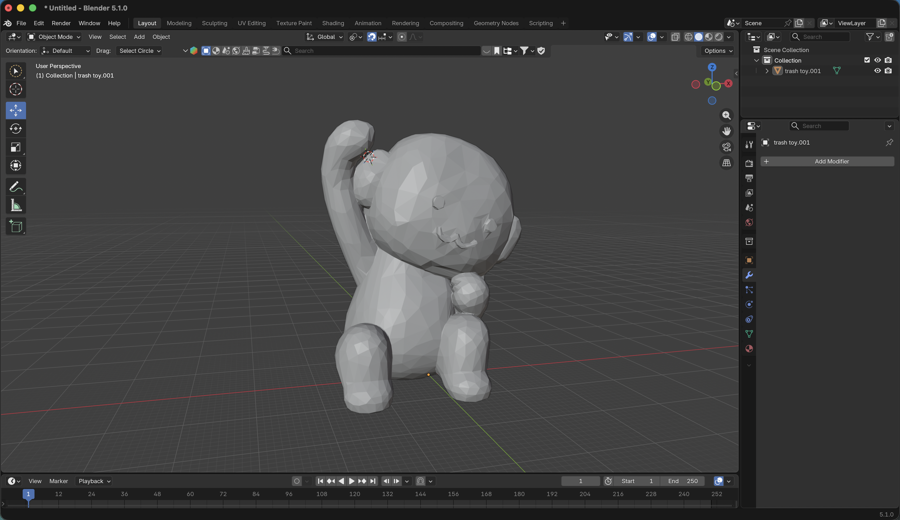

# Side Project: Bear Fix (helping a classmate)

**Date added:** 2026-10-02
**Status:** Done. File fixed and sent back.

## What happened
- A classmate had a toy model called "trash toy" (a bear figure) that was giving them trouble
- I fixed the file in Blender and gave it back

## Before and after
- Before: very detailed mesh, 86,730 triangles, 4.3 MB file. Had a weird flat artifact (stray shape) attached to the raised hand
- After: simplified low poly mesh, 3,356 triangles, 168 KB file. I removed the artifact connected to the hand and the bear is still recognisable

## Files
- `bear-fix/trash-toy-before.stl`: the original from my classmate
- `bear-fix/trash-toy-fixed.stl`: my fixed version

## TBD
- Exactly what was wrong with the original for their print (my guess from the screenshot: file too heavy plus the artifact)
- Which Blender steps I used (decimate or remesh, how the artifact was removed (I removed it myself, steps not noted yet))
- Classmate's name, if they want to be credited
